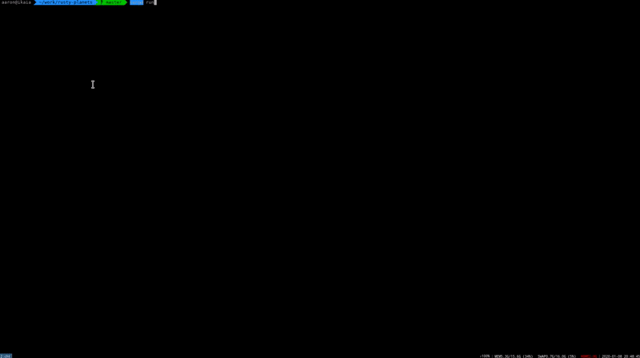

# Rusty Planets Excercise



For [reading consortium](reading-consortium.github.io/).

Let's make a universe simulator in a few hundred lines of Rust! Once it runs and does nothing, try adding gravity. When gravity works, add initial velocities and you'll get what I have above.


Usage:

```bash
$ cargo run
```

## Helpful Links
[Gravitational force](https://en.wikipedia.org/wiki/Gravitational_acceleration#Relation_to_the_Universal_Law) with some predefined velocities will cover most of your work. For spawning objects into a stable rotation, you're going to need [the equation for relative velocity](https://en.wikipedia.org/wiki/Circular_orbit#Velocity).

If you choose to use nalgebra, their [primary site](https://nalgebra.org/) has a lot of links on it. The imports provided in the skeleton should take care of most of your needs.

Most of the piston work has been done for you already. Just call rectange or another shape on the inner render method of the trait.
[draw_2d](http://docs.piston.rs/piston_window/piston_window/struct.PistonWindow.html#method.draw_2d) is doing the heavy lifting. See [piston_window's GitHub](https://github.com/PistonDevelopers/piston_window) for more help.

If you need tips, please feel free to hop on consortium-approved chat chanenls and ask!
